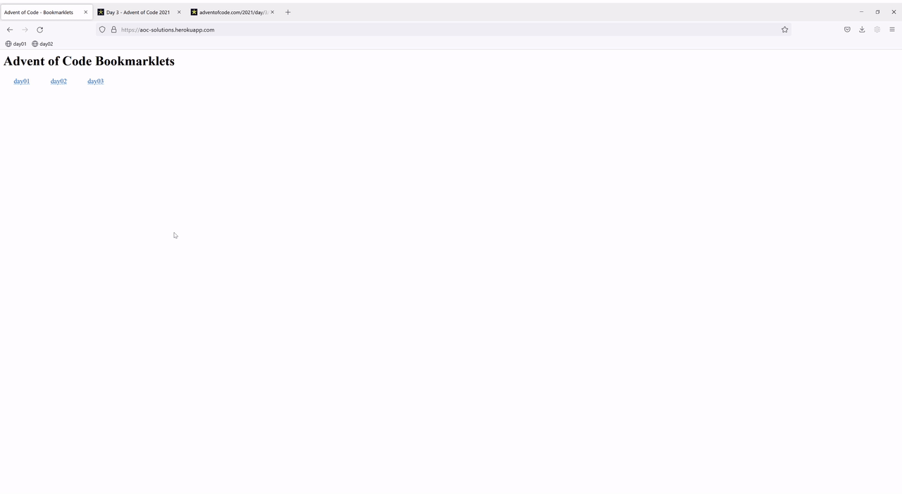

# aoc-solutions

This project uses webpack to create [bookmarklets](https://en.wikipedia.org/wiki/Bookmarklet) for [Advent of Code 2021](https://adventofcode.com/).

It is continously deployed to Heroku: [https://aoc-solutions.herokuapp.com/](https://aoc-solutions.herokuapp.com/).

Here is a quick illustration of how you can use the bookmarklets to get a solution


The bookmarklets include a check if they are executed on adventofcode.com and won't do anything anywhere else.
```javascript
if(window.location.host === 'adventofcode.com' )
```
